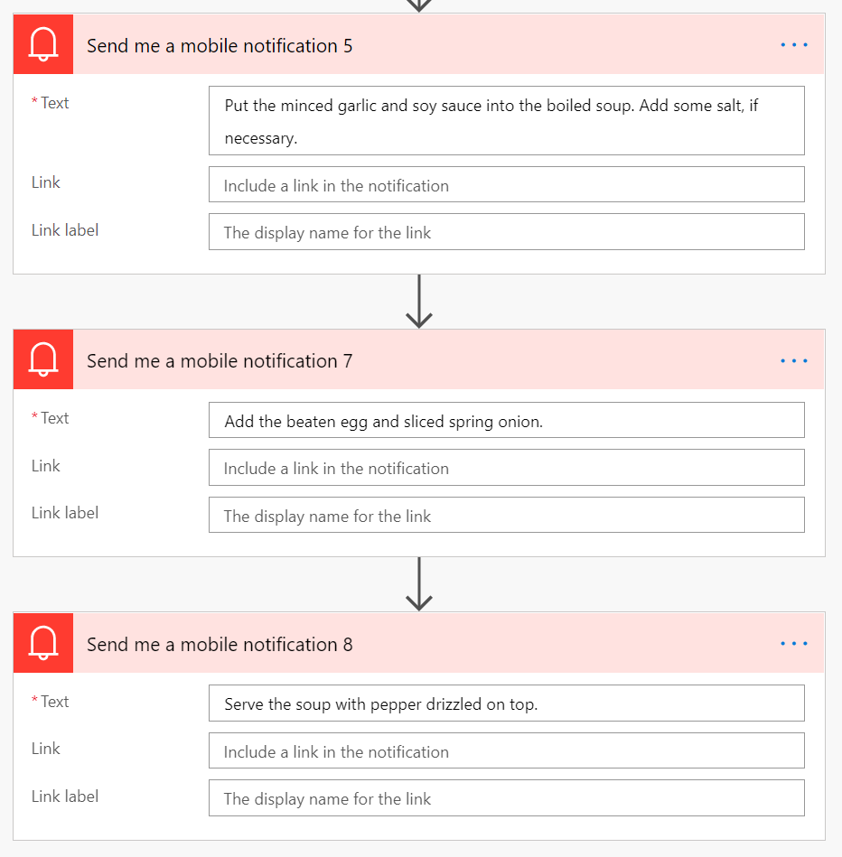

# Challenge 5: The best soup

## This week's featured region: Korea

In Korea, when New Year begins, everyone eats tteok-guk (rice cake soup). There are various shapes of tteok, but especially for greeting New Year, garae-tteok is the most popular to make the soup.

As garae-tteok has a long and cylindrical shape, people wish to live long, by eating tteok-guk. When cooking tteok-guk, the garae-tteok is sliced into small pieces, which look like coins. This coin-like shape is believed to bring wealth.

### Ingredients (for 4 people)
- Garae-tteok: 400g
- Diced beef: 100g
- Water: 10 cups
- Eggs: 2
- Spring onion: 1
- Minced garlic: 1 tablespoon
- Soy sauce: 2 tablespoon
- Sesame oil: 1 tablespoon
- Olive oil: 1 tablespoon
- Salt and pepper

### Recipe
1. Slice garae-ttok into small pieces – no thicker than 5 mm.
 - You can buy sliced garae-tteok.
 - But in this case, put the sliced garae-tteok into a bowl of water for about 30 mins.
2. Slice spring onion.
3. At high heat, stir-fry the diced beef with sesame oil and olive oil until the beef surface goes brown.
4. Put the water into the wok and boil for about 30 mins with medium heat.
5. While boiling, remove bubbles from the water from time to time.
6. Get the eggs beaten.
7. After the 30 mins, put the minced garlic and soy sauce into the boiled soup. Add some salt, if necessary.
8. Add the beaten egg and sliced spring onion.
9. Serve the soup with pepper drizzled on top.

## Your challenge 🍽
This recipe calls for several steps, and we want to create an automated process to set reminders for each step. For example, if you buy the sliced garae-tteok, you should wait for 30 mins for them to soak. Make sure that the stir-fried beef goes brown in 8 mins but it may take longer than that! And don't let anything burn! This is a good opportunity to try Azure Functions, Azure Durable Functions, Azure Queue Storage, Azure Service Bus, Azure Event Grid, Power Platform or something else!

## Resources/Tools Used 🚀
- PowerAutomate
- Microsoft Flow Mobile App (for testing)

## My solution 💡
I used Power Automate for my solution. A cool thing about Power Automate is it includes a tool called Microsoft Flow. Microsoft Flow [runs on top of Azure Logic Apps](https://www.serverless360.com/blog/azure-logic-apps-vs-microsoft-flow#:~:text=While%20Microsoft%20Flow%2C%20runs%20on,are%20some%20differences%20that%20exist.&text=The%20Microsoft%20Flow%20product%20group,PowerApps%2C%20PowerBI%2C%20and%20Dynamics365.) making it serverless! It is also no-code.

### Input

To begin, I created the following Flow in Power Automate. I'll walk through the solution step by step:

#### Step 1: Manually trigger flow by typing "Begin soup"

#### Step 2: First notificiation is sent

#### Step 3: First 30 minute delay

#### Step 4: After 30 minutes, four more notifications are sent

#### Step 5: Second 30 minute delay

#### Step 6: After 30 minutes, the final three notifications are sent

### Output
After clicking **Run** in Power Automate and inputting our trigger, there are two distinct outputs. The first output is in Power Automate's web interface and notifies us whether our flow ran successfully. I can tell from my interface that all of my instances have run successfully.

The second, and perhaps more important, output can be seen after downloading the Microsoft Flow app. After running the solution in Power Automate, I would recieve Push Notifications of my phone for when to complete certain tasks. I can tell by the timestamps that the push notifications are running correctly.

## Try it out yourself
If you're interesting in trying it out yourself, send me your email and I can share the solution in Power Automate.

