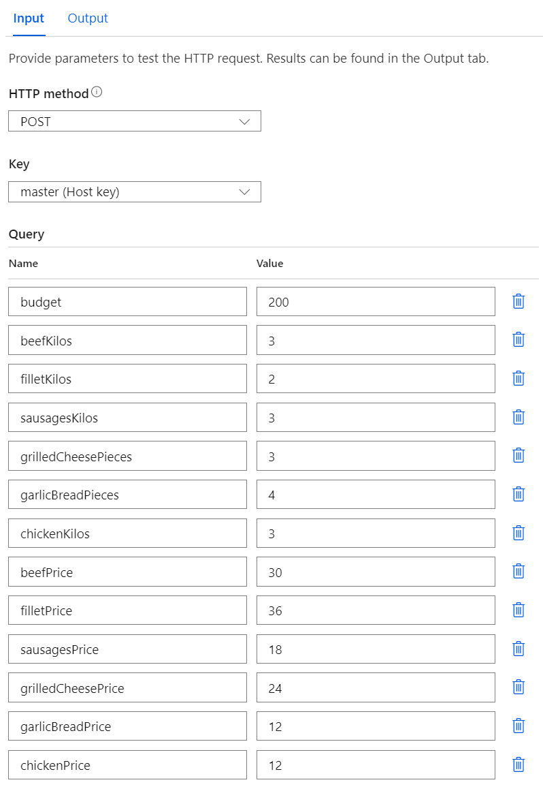
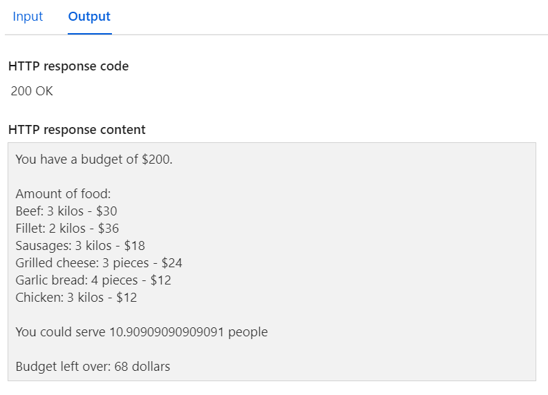

# Challenge 4: A Big Barbecue!

## This week's featured region: Brazil

In Brazil, everyone loves a big barbecue! Brazilian barbecue is justifiably famous. Everyone's friends and family gets together for a feast, complete with grilled meats called churrasco, typically beef with different marinades. You can also find prime rib, linguica (a kind of sausage), lamb kebabs, chicken legs, fish, and much more.

Some families have created whole systems to help organize the amount of food needed for the number of people invited to a big barbecue. We have gained access to a spreadsheet used to organize large family barbecues: [here it is](graphics/bbq-spreadsheet.xlsx).

Big events like this can get expensive, and you need to stay in within your budget. The spreadsheet used here is an example that you can use as a starting point to determine how many people will attend the barbecue, how much food will be needed, and how much it will cost. The excel file is still lacks some data, such as prices for food, but you can use your own local prices and estimates.

## Your challenge 🍽 

Using the spreadsheet as inspiration, create a serverless method of determining how many people you can invite based on a given budget (you can determine your budget and currency). Can you invite more people if you serve less fillet and more grilled cheese? Show us a good solution to create a really big BBQ!

## Resources/Tools Used 🚀
- Visual Studio Code
- Azure Functions Extension

## My solution 💡

### Input

### Output

## Try it out yourself:
Copy and paste this link into your web browser: https://bestbbq.azurewebsites.net/api/bestBBQ?budget=200&beefKilos=3&filletKilos=2&sausagesKilos=3&grilledCheesePieces=3&garlicBreadPieces=4&chickenKilos=3&beefPrice=30&filletPrice=36&sausagesPrice=18&grilledCheesePrice=24&garlicBreadPrice=12&chickenPrice=12
