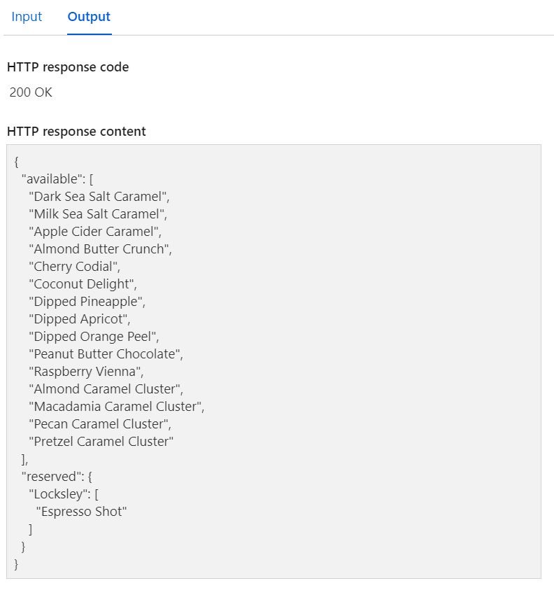

# Challenge 6: The Magic Chocolate Box

## This week's featured region: France

## Your challenge 🍽 

Develop a serverless solution that will allow each family member to let you know their favorite chocolates from your family's limited choice. You might want to reserve your own favorite ones in advance! And you'll need to get creative to divide the chocolates evenly, or according to the individual person's taste (or merit?). Here's a [list of chocolate varieties](https://www.vogue.fr/lifestyle-en/article/the-10-best-parisian-chocolatiers-of-2019) to inspire you.

## Resources/Tools Used 🚀

- [Visual Studio Code](https://code.visualstudio.com/?WT.mc_id=academic-10922-cxa)
- [Azure Functions Extension](https://marketplace.visualstudio.com/items?itemName=ms-azuretools.vscode-azurefunctions&WT.mc_id=academic-10922-cxa)
- [Durable Entities](https://docs.microsoft.com/en-us/azure/azure-functions/durable/durable-functions-entities?tabs=csharp&WT.mc_id=academic-10922-cxa)

## My solution 💡
My solution follows three steps:

### Step 1: Make a reservation

#### Input

#### Output

### Step 2: See updated chocolates and reservations

#### Input

#### Output

### Step 3: Clear all reservations

#### Input

#### Output

## Try it out yourself:

### [Make a reservation](https://choosechocolates.azurewebsites.net/api/ReserveChocolate?name=Alice&item=Pecan%20Caramel%20Cluster)

### [Get reservations](https://choosechocolates.azurewebsites.net/api/GetReservations)

### [Clear reservations](https://choosechocolates.azurewebsites.net/api/ReserveChocolate?reset=true)

