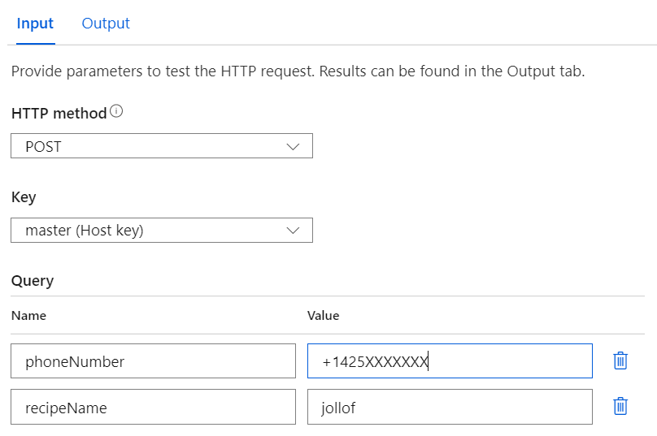
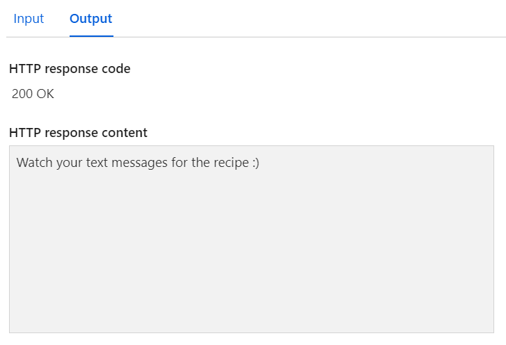
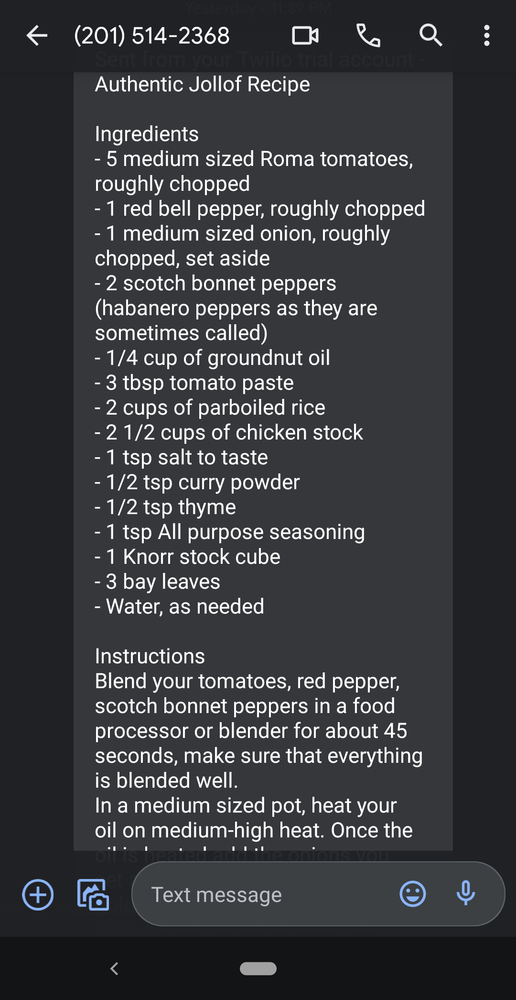

# Challenge 7: The Recipe Connector

## This week's featured region: Africa

In Africa, city cooks want to reconnect with their country roots. In Kenya, there are many traditional dishes, but no one in Nairobi remembers how to make them! In Lagos, Nigeria, cooks are eager to recreate their grandmother's famous jollof rice, but they can't quite remember the proportions of ingredients. Let's set up a City/Country hotline!

## Your challenge 🍽 

Create a service that will allow a user to send a query for a specific dish to a given relative of your choosing and receive the appropriate and authentic recipe. You could set up a service to call your Grandma to make sure you have the right ingredients for great jollof rice using [Azure Functions bindings for Twilio](https://docs.microsoft.com/en-us/azure/azure-functions/functions-bindings-twilio?tabs=csharp&WT.mc_id=academic-10922-cxa).

## Resources/Tools Used 🚀

-   **[Visual Studio Code](https://code.visualstudio.com/?WT.mc_id=academic-10922-cxa)**
-   **[Azure Functions Extension](https://marketplace.visualstudio.com/items?itemName=ms-azuretools.vscode-azurefunctions&WT.mc_id=academic-10922-cxa)**
-   **Twilio**

## My solution 💡
I used JavaScript, Azure Functions, and Twilio for my solution. When a user inputs their phone number and recipe they're requesting, they will recieve a text message of that recipe.

### Input

### Output

### Text message output

## Try it out yourself

Unfortunately, this solution would be very challenging to try it out yourself. Typically, you could follow the link below with your inputted phone number and recieve a SMS response of the jollof recipe but this will produce an error message:

https://recipeconnector.azurewebsites.net/api/recipeConnector?phoneNumber=+1425XXXXXXX&recipeName=jollof.

This is because I used the free trial of Twilio.
